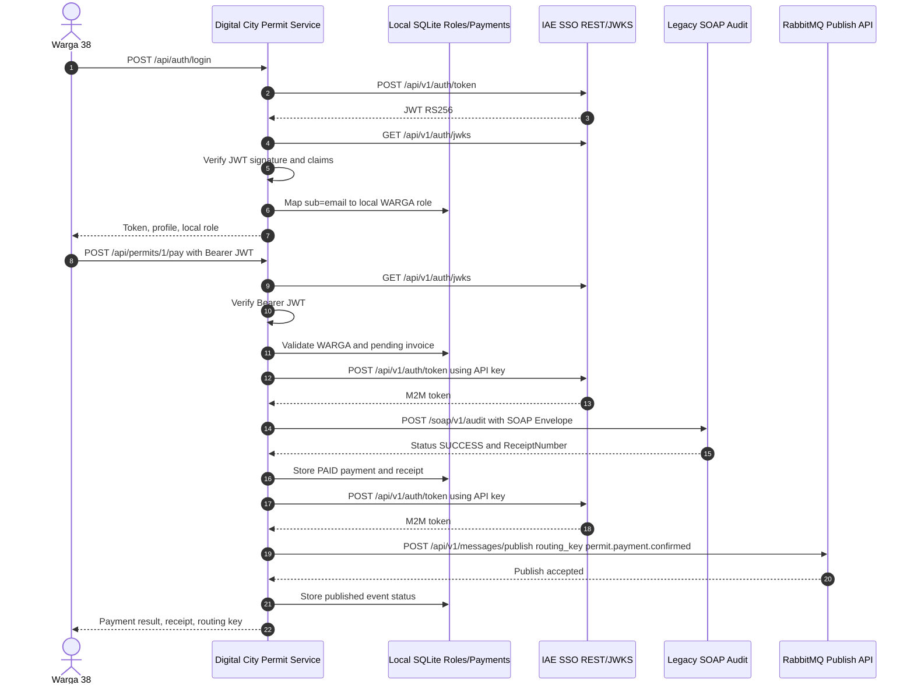

# Analisis Tugas 3 - Digital City Permit Payment

## Transaksi Kritis

Transaksi yang dipilih adalah `PermitPaymentConfirmed`, yaitu pembayaran izin warga untuk layanan Digital City. Transaksi ini termasuk kritis karena mengubah state invoice dari `PENDING` menjadi `PAID`, menghasilkan bukti pembayaran, dan dapat memicu proses lintas departemen seperti validasi izin, pencetakan dokumen, dan notifikasi pelayanan warga.

Pembayaran juga termasuk transaksi keuangan, sehingga harus dicatat ke sistem audit legacy menggunakan SOAP/XML. Setelah audit berhasil, aktivitas bisnis disebarkan secara asinkron melalui RabbitMQ supaya departemen lain bisa bereaksi tanpa menunggu proses utama.

## Role Lokal

User SSO `warga38@ktp.iae.id` dipetakan ke role lokal `WARGA`.

Permission lokal:

- `permit:read`: melihat daftar invoice izin milik warga.
- `permit:pay`: melakukan pembayaran invoice izin yang masih `PENDING`.

## Sequence Diagram Internal

## Data yang Diaudit SOAP

SOAP `LogContent` berisi JSON di dalam CDATA:

- `team_id`: `TEAM-38`
- `activity_name`: `PermitPaymentConfirmed`
- `transaction_type`: `PERMIT_PAYMENT`
- `permit_number`: nomor izin
- `citizen_email`: subjek SSO warga
- `amount`: nilai pembayaran
- `method`: metode pembayaran
- `occurred_at`: waktu transaksi
- `actor`: email SSO dan role lokal

## Event RabbitMQ

Routing key: `permit.payment.confirmed`

Payload JSON berisi ringkasan izin, pembayaran, `receipt_number` dari SOAP, `team_id`, service name, timestamp, dan identitas aktor. Event ini memungkinkan departemen lain menerima notifikasi pembayaran tanpa coupling langsung ke service pembayaran.
